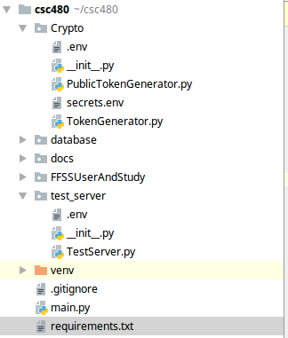

# buhtan-no-5
## Getting Started
Team Engine is building the back end with Python >3.5 and Flask-Restful.

First ensure that all of the required packages are installed.
```
python3 -m pip install -r requirements.txt  
```
Next ensure that the .env file is located both in the Crpyto Folder and test_server folder. This is essential
for any of the encryption and decryption operations.Refer to the image below.



[//]: # (### A valid markdown comment but it appears to be only one line)

## Database
[//]: # (### A valid markdown comment but it appears to be only one line)

## Database
Database of use is MongoDB Atlas. This is a NoSQL database which is secured by TLS/SSL authentication. Using pymongo Engine and Database will be able to connect using the MongoClient mondule. To connect to the Database copy and paste the function below.
```
def connector():
    env_path = os.path.abspath(os.path.dirname(__file__))
    location = os.path.join(env_path, '.env')
    load_dotenv(dotenv_path=location)
    client = MongoClient(os.getenv('MongoURL'))
    db = client["StudyStore"]
    return db
```
Then change the "Mongo URL" placeholder with the connection string located in the env file.


## Deployment
Engine has decided to utilize gunicorn to create workers in order to handle requests. Engine is currently researching if nginx will be utilized due to system permission issues.
For Unix systems with venv installed.To run the local flask instance execute the below commands.
```
source venv/bin/activate
python3 main.py
```
In order to deploy the instance utilizing gunicorn, run the below command.The system which the flask server is running did not allow for gunicorn to be installed in accordance with permission isuses.This will run the instance until the session is terminated.
```
 python3 launcher.py --bind 0.0.0.0:8000 gun:app
```
IOT run the server as a background process, run the following:
```
nohup python3 launcher py --bind ip_address:port class:app_name & >/dev/null & 
```

## Documentation
This project will use Sphinx to create local documentation to aide others.There will be a readthedocs in the future.
* [CheatSheet](https://github.com/adam-p/markdown-here/wiki/Markdown-Cheatsheet) is a great resourse to utilize in order to improve the README.


## Built With
* [FLASK](https://pypi.org/project/Flask/) - Web Framework used
* [FLASK-RESTFUL](https://flask-restful.readthedocs.io/en/latest/) - RESTFul Framework
* [Gunicorn](https://gunicorn.org/) -Python Web Server Gateway Interface (WSGI)
* [Sphinx](https://www.sphinx-doc.org/en/master/) Tool used to build Documentation

## Authors

* **msglarson** - *Cool Americans* 
* **besoir** - *TREX*
* **jbald98** - *UML Wizard*
* **nahyromolina** - *Dancer*
* **bgroman** - **
